# Syngenta Oracle System - Cloud Infrastructure Diagram

## System Overview
The Syngenta Oracle SDK enables agricultural data management on the Cardano blockchain, providing verifiable farm data, sustainability metrics, and oracle feeds for agricultural applications.

## Cloud Infrastructure Architecture

```mermaid
graph TB
    %% External Data Sources
    subgraph "Data Sources"
        IoT[IoT Sensors<br/>Soil, Weather, Crop]
        Satellite[Satellite Imagery<br/>Farm Monitoring]
        Manual[Manual Data Entry<br/>Farm Management Systems]
        Sustainability[Sustainability Metrics<br/>Environmental Data]
    end

    %% Data Processing Layer
    subgraph "Data Processing & Validation"
        API[API Gateway<br/>AWS API Gateway]
        Lambda[Data Processing<br/>AWS Lambda Functions]
        Validation[Data Validation<br/>Business Rules Engine]
        IPFS[IPFS Storage<br/>Decentralized File Storage]
    end

    %% Application Layer
    subgraph "Application Services"
        OracleService[Oracle Service<br/>Node.js/TypeScript]
        WalletService[Wallet Management<br/>Cardano Wallet Integration]
        NotificationService[Notification Service<br/>AWS SNS/SES]
        MonitoringService[Monitoring Service<br/>CloudWatch/DataDog]
    end

    %% Blockchain Layer
    subgraph "Cardano Blockchain"
        CardanoMainnet[Cardano Mainnet<br/>Production Network]
        CardanoTestnet[Cardano Testnet<br/>Preprod Network]
        Blockfrost[Blockfrost API<br/>Cardano Node Access]
        SmartContracts[Smart Contracts<br/>Plutus V3 Scripts]
    end

    %% Database Layer
    subgraph "Data Storage"
        PostgreSQL[(PostgreSQL<br/>Farm Data & Metadata)]
        Redis[(Redis Cache<br/>Session & Temp Data)]
        S3[AWS S3<br/>File Storage & Backups]
    end

    %% Security & Identity
    subgraph "Security & Identity"
        IAM[AWS IAM<br/>Access Control]
        KMS[AWS KMS<br/>Key Management]
        Vault[HashiCorp Vault<br/>Secrets Management]
        WAF[AWS WAF<br/>Web Application Firewall]
    end

    %% Monitoring & Logging
    subgraph "Observability"
        CloudWatch[AWS CloudWatch<br/>Logs & Metrics]
        XRay[AWS X-Ray<br/>Distributed Tracing]
        Grafana[Grafana<br/>Dashboards]
        Prometheus[Prometheus<br/>Metrics Collection]
    end

    %% Frontend Applications
    subgraph "Client Applications"
        WebApp[Web Application<br/>React/Vue.js]
        MobileApp[Mobile App<br/>React Native/Flutter]
        AdminPanel[Admin Panel<br/>Farm Management]
        APIClients[API Clients<br/>Third-party Integrations]
    end

    %% Data Flow Connections
    IoT --> API
    Satellite --> API
    Manual --> API
    Sustainability --> API

    API --> Lambda
    Lambda --> Validation
    Validation --> OracleService
    OracleService --> WalletService
    WalletService --> Blockfrost
    Blockfrost --> CardanoMainnet
    Blockfrost --> CardanoTestnet
    CardanoMainnet --> SmartContracts
    CardanoTestnet --> SmartContracts

    OracleService --> PostgreSQL
    OracleService --> Redis
    OracleService --> IPFS
    OracleService --> S3

    %% Security connections
    IAM --> OracleService
    KMS --> WalletService
    Vault --> OracleService
    WAF --> API

    %% Monitoring connections
    OracleService --> CloudWatch
    Lambda --> CloudWatch
    API --> XRay
    OracleService --> Prometheus
    Prometheus --> Grafana

    %% Client connections
    WebApp --> API
    MobileApp --> API
    AdminPanel --> API
    APIClients --> API

    %% Notification flow
    OracleService --> NotificationService
    NotificationService --> WebApp
    NotificationService --> MobileApp

    %% Styling
    classDef dataSource fill:#e1f5fe
    classDef processing fill:#f3e5f5
    classDef application fill:#e8f5e8
    classDef blockchain fill:#fff3e0
    classDef storage fill:#fce4ec
    classDef security fill:#ffebee
    classDef monitoring fill:#f1f8e9
    classDef client fill:#e3f2fd

    class IoT,Satellite,Manual,Sustainability dataSource
    class API,Lambda,Validation,IPFS processing
    class OracleService,WalletService,NotificationService,MonitoringService application
    class CardanoMainnet,CardanoTestnet,Blockfrost,SmartContracts blockchain
    class PostgreSQL,Redis,S3 storage
    class IAM,KMS,Vault,WAF security
    class CloudWatch,XRay,Grafana,Prometheus monitoring
    class WebApp,MobileApp,AdminPanel,APIClients client
```

## Key Components Explained

### 1. Data Sources
- **IoT Sensors**: Real-time soil, weather, and crop monitoring data
- **Satellite Imagery**: Farm boundary detection and crop monitoring
- **Manual Data Entry**: Farm management system integrations
- **Sustainability Metrics**: Environmental impact and compliance data

### 2. Data Processing Layer
- **API Gateway**: Centralized entry point with rate limiting and authentication
- **Lambda Functions**: Serverless data processing and validation
- **Business Rules Engine**: Validates farm data against agricultural standards
- **IPFS Storage**: Decentralized storage for farm boundaries and metadata

### 3. Application Services
- **Oracle Service**: Core service using the Syngenta Oracle SDK
- **Wallet Management**: Cardano wallet integration and key management
- **Notification Service**: Real-time alerts and updates
- **Monitoring Service**: System health and performance monitoring

### 4. Cardano Blockchain Integration
- **Mainnet/Testnet**: Production and testing environments
- **Blockfrost API**: Cardano node access and transaction management
- **Smart Contracts**: Plutus V3 scripts for oracle data management

### 5. Data Storage
- **PostgreSQL**: Relational database for farm metadata and user data
- **Redis**: Caching layer for session management and temporary data
- **AWS S3**: Object storage for files, backups, and static assets

### 6. Security & Identity
- **AWS IAM**: Role-based access control
- **AWS KMS**: Cryptographic key management
- **HashiCorp Vault**: Secrets and configuration management
- **AWS WAF**: Web application firewall protection

### 7. Observability
- **CloudWatch**: Centralized logging and metrics
- **X-Ray**: Distributed tracing for performance analysis
- **Grafana**: Visualization dashboards
- **Prometheus**: Metrics collection and alerting

## Deployment Considerations

### High Availability
- Multi-AZ deployment across AWS regions
- Auto-scaling groups for application services
- Database replication and failover

### Security
- End-to-end encryption for data in transit and at rest
- Regular security audits and penetration testing
- Compliance with agricultural data regulations

### Scalability
- Horizontal scaling of application services
- Database sharding for large datasets
- CDN for static asset delivery

### Cost Optimization
- Spot instances for non-critical workloads
- Reserved instances for predictable workloads
- Automated resource scheduling

## Integration Points

1. **Cardano Wallet Integration**: Secure key management and transaction signing
2. **IPFS Integration**: Decentralized storage for farm boundaries and metadata
3. **Blockfrost API**: Cardano blockchain interaction and transaction management
4. **Smart Contract Deployment**: Automated deployment of Plutus scripts
5. **Oracle Data Updates**: Real-time updates to blockchain oracle feeds

This infrastructure supports the full lifecycle of agricultural data management, from collection to blockchain storage, providing a robust and scalable platform for the Syngenta Oracle system.
